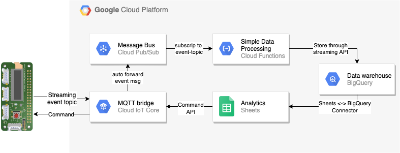

# Sensor data collection and ad-hoc analytics
In this tutorial you use [Environmental Sensor Board](https://coral.withgoogle.com/products/environmental) to connect to [Cloud IoT Core](https://cloud.google.com/iot-core/) and stream sensor data to [Cloud Pub/Sub](https://cloud.google.com/pubsub/). You use [Cloud Functions](https://cloud.google.com/functions/) to collect and process the sensor data from Pub/Sub and store them in [BigQuery](https://cloud.google.com/bigquery/). [Google Sheets](https://docs.google.com/spreadsheets) is use for doing analytics on the sensor data in BigQuery and send command messages to the Sensor Board using the [IoT Core Commands API](https://cloud.google.com/iot/docs/how-tos/commands).

## Architecture
Architectural overview of solution setup


## Objectives
- Provisioning of the Environmental Sensor Board
- Setup Cloud Functions for sensor data processing
- Setup BigQuery for data storage
- Setup Google Sheet to integrate with BigQuery and IoT Core

## Prerequisite
- Environmental Sensor Board
- Raspberry Pi with [Raspbian](https://www.raspberrypi.org/downloads/) and connected to the internet
- This tutorial assumes that you already have a [GCP account](https://console.cloud.google.com/freetrial) set up.

## Create a GCP project
1. Go to the [GCP Console](https://console.cloud.google.com).
1. Click the project selector in the upper-left corner and select **New Project**.
1. Give the project a name and click **Create**.
1. Click the project selector again and select your new project.
1. Open the menu **APIs & Services > Library**.
1. Search for and activate the following APIs, or ensure that they are already active:
    - Cloud Functions API
    - Cloud Pub/Sub API
    - Cloud BigQuery API

## Provision the Sensor Board
Attach the Sensor Board to the 40-pin header of your Raspberry Pi and power on your board.
### Install the Environmental Sensor Board library and driver
Commands are run in a Raspberry Pi shell.
```bash
echo "deb https://packages.cloud.google.com/apt coral-cloud-stable main" | sudo tee /etc/apt/sources.list.d/coral-cloud.list

curl https://packages.cloud.google.com/apt/doc/apt-key.gpg | sudo apt-key add -

sudo apt update

sudo apt upgrade

sudo apt install python3-coral-enviro
```
Reboot your board
```bash
sudo shutdown -r now
```
### Check out the tutorial source code on your board
```bash
cd ~

git clone https://github.com/kingman/enviro-workshop.git
```
### Get the public key of the secure element of your sensor board
```bash
cd /usr/lib/python3/dist-packages/coral/cloudiot

python3 ecc608_pubkey.py
```
Copy the public key which is used at later stage when creating device identity in cloud.

## Provision device identity on GCP
For device to communicate with IoT Core, the device identity needs to be created in IoT Core. Following commands are run in [Cloud Shell](https://cloud.google.com/shell/docs/features).

###  Check out the tutorial source code on Cloud Shell
1. In the GCP Console, [open Cloud Shell](http://console.cloud.google.com/?cloudshell=true)
1. Clone the source code repository:

```bash
cd ~

git clone https://github.com/kingman/enviro-workshop.git
```
### Set the environment variables
```bash
cd ~/enviro-workshop/cloud-setup
```
In the file: `set_env_variables.sh` replace the values for `EVENT_TOPIC`,`REGISTRY_ID` and `DEVICE_ID` with id:s of your choice.

**Note** Replace the whole string after the `=` sign. The `<` and `>` brackets should be replaced as well.  
Name must be between 3 and 255 characters
Name must start with a letter, and contain only the following characters: letters, numbers, dashes (-), periods (.), underscores (\_), tildes (~), percents (%) or plus signs (+).

Set the environment variables:
```bash
source set_env_variables.sh
```
### Create Pub/Sub topic
```bash
gcloud pubsub topics create $EVENT_TOPIC
```
### Create IoT Core registry
```bash
gcloud iot registries create $REGISTRY_ID \
--region $REGION \
--event-notification-config=topic=$EVENT_TOPIC
```
### Create the public key file of the sensor board
Create a file named `device_pub_key.pem` with the public key that were printed out earlier in the **Get the public key...** step.
```bash
cd ~/enviro-workshop/cloud-setup

touch device_pub_key.pem
```
Use a text editor to get the public key string into the file. Content starts with `-----BEGIN PUBLIC KEY-----` and ends with `-----END PUBLIC KEY-----`
### Create IoT Core device
Create the sensor board identity in the newly created IoT Core registry with Sensor Board public key. In Cloud Shell run:
```bash
gcloud iot devices create $DEVICE_ID \
--region=$REGION \
--registry=$REGISTRY_ID \
--public-key=path=device_pub_key.pem,type=es256
```

## Verify the data ingestion setup
You have now all the building blocks set up and integrated for ingestion of data from the Sensor Board to GCP. In this section you verify end-to-end integration between the Sensor board and Cloud Pub/Sub.
### Create event topic subscription
In Cloud Shell run:
```bash
gcloud pubsub subscriptions create verify-event \
--topic=$EVENT_TOPIC
```
### Configure Raspberry Pi
Configure Raspberry Pi to send sensor data to IoT Core
In Raspberry Pi shell open the cloud config file: `~/enviro-workshop/enviro-device/cloud_config.ini` and replace the place holders `<project-id>`, `<registry-id>` and `<device-id>` with the actual values for the Cloud IoT Core environment setup in earlier step.

### Download the CA-certificate
In Raspberry Pi shell run:
```bash
cd ~/enviro-workshop/enviro-device/

wget https://pki.goog/roots.pem
```
### Run the streaming script
In Raspberry Pi shell run:
```bash
cd ~/enviro-workshop/enviro-device/

python3 enviro_demo.py --upload_delay 5
```
Let the script run for 20 second before stop it by press `ctrl-c`
### Verify sensor data in Pub/Sub
Pull message from Pub/Sub subscription. In Cloud Shell run:
```bash
gcloud pubsub subscriptions pull verify-event --auto-ack
```
Verify you get the messages from the Sensor Board

## Setup the Cloud Function for process sensor data
### Set environment variable for BigQuery dataset and table
Choose name for your BigQuery dataset and table where the sensor data will be stored, and export them as environment variables. In Cloud Shell run:
```bash
export DATASET=<replace_with_your_dataset_name>

export TABLE=<replace_with_your_table_name>
```
### Deploy Cloud Function
In Cloud Shell run:
```bash
cd ~/enviro-workshop/functions

gcloud functions deploy enviro \
--set-env-vars DATASET=${DATASET},\
TABLE=${TABLE} \
--region ${REGION} \
--trigger-topic ${EVENT_TOPIC} \
--runtime nodejs8 \
--memory 128mb
```
## Setup data storage
Create the dataset and table in BigQuery.
In Cloud Shell run:
```bash
cd ~/enviro-workshop/bq

bq mk $DATASET

bq mk ${DATASET}.${TABLE} schema.json
```
## Start the sensor data stream
You can control the interval of sensor data is sent to Cloud by setting the `upload_delay` parameter. In Raspberry Pi shell run:
```bash
cd ~/enviro-workshop/enviro-device/

python3 enviro_demo.py --upload_delay 15
```
## View sensor data in BigQuery
Open the [BigQuery console](http://console.cloud.google.com/bigquery),
paste following query into the **Query editor** and press **Run**. Replace the place holders `<PROJECT_ID>`, `<DATASET>`, and `<TABLE>` with your environment values.
```sql
SELECT * FROM `<PROJECT_ID>.<DATASET>.<TABLE>`
ORDER BY time DESC
LIMIT 20
```
Verify a table with sensor data is returned.

## Data analytics and device control
### Google Sheets setup
